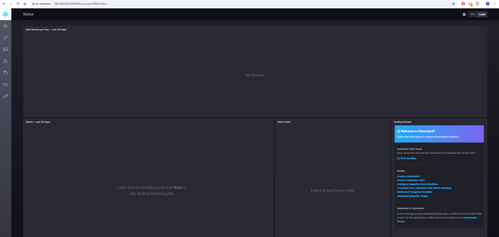
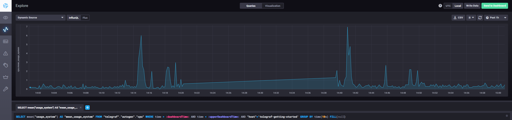
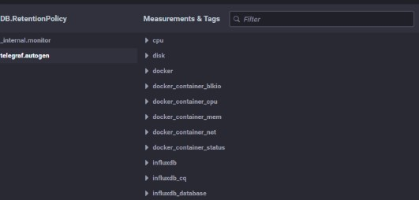

# Домашнее задание к занятию "13.Системы мониторинга"

## 1. Минимальный набор метрик для мониторинга

- CPU:
  - CPU utilization
  - Load Average
- RAM:
  - Memory utilization
- DISK:
  - Space utilization
  - Disk write request avg waiting time
  - Disk read request avg waiting time
- NET:
  - Response Time (время отклика на HTTP запрос)
  - HTTP Request Status (количество успешных запросов, ошибок 4xx и 5xx)

## 2. Метрики для менеджера продукта

Менеджеру можно предоставить следующие метрики:

- Response Time (для оценки скорости обслуживания пользователей)
- HTTP Request Status (для понимания частоты ошибок)
- Uptime average (для оценки времени безотказной работы)
- NPS (метрика удовлетворенности клиентов)
- Жалобы (количество обращений по тех. проблемам)

## 3. Логирование ошибок для разработчиков

Для решения задачи:

- Настроить вывод логов в отдельный файл.
- Использовать логротейт.
- Дать доступ разработчикам к логам через веб или файловую шару.
- Использовать бесплатные решения, например, Sentry.
- Настроить простейшие оповещения (например, на почту) при недоступности сервиса более 5 минут.

## 4. Ошибка в вычислениях SLA

Ошибка в формуле. Для правильного расчета нужно учитывать также 3xx коды. Правильная формула:

**summ_2xx_requests + summ_2xx_requests)/summ_all_requests**

## 5. Плюсы и минусы моделей мониторинга

### Push:

- **Плюсы**:
  - Централизация: все делаем в одном месте.
  - Меньше нагрузки на системы, с которых собираем данные.
  - Удобство и гибкость настройки.

- **Минусы**:
  - Проблемы с масштабированием.
  - Нагрузка на сервер.
  - Задержки в интервалах опросов.

### Pull:

- **Плюсы**:
  - Меньше нагрузки на сервер.
  - Масштабируемость: можно распределять нагрузку.
  - Упрощенная отладка.

- **Минусы**:
  - Меньшая гибкость.
  - Нагрузка на хосты с агентами.

## 6. Модели мониторинга

- **Prometheus** - `pull`
- **TICK** - `push`
- **Zabbix** - `гибридная`
- **VictoriaMetrics** - `push`
- **Nagios** - `pull`

## 7. Скриншот веб-интерфейса Chronograf

- 

## 8. Метрики утилизации CPU в веб-интерфейсе Chronograf

- 

## 9. Добавление плагина docker в Telegraf

- 

